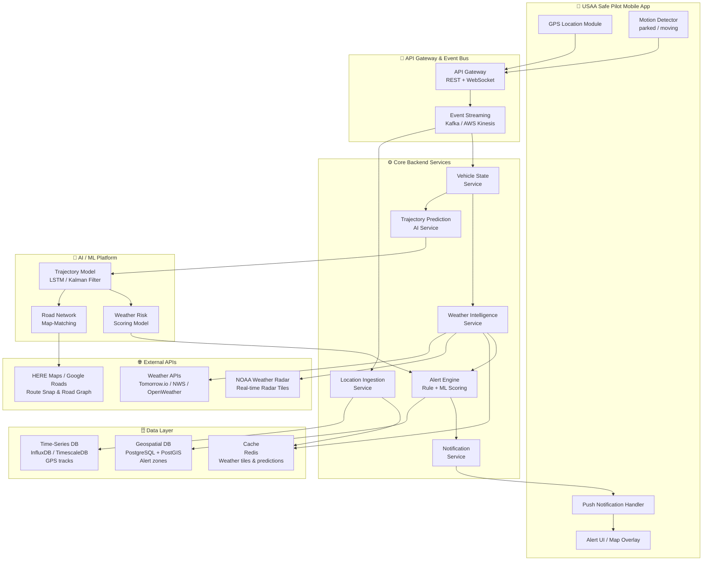
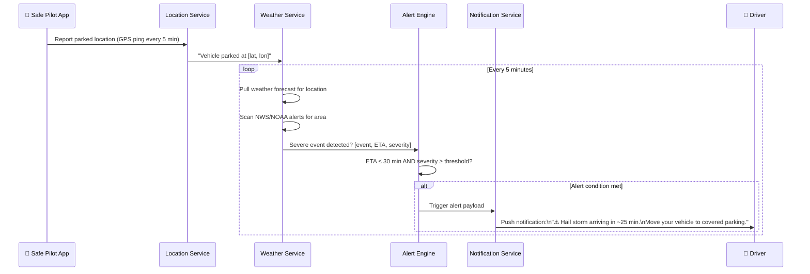
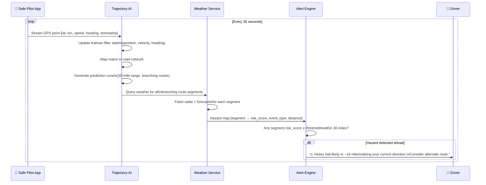

# USAA Safe Pilot — Weather-Based Vehicle Alert System
## Hackathon Design Document

---

## 1. Executive Summary

The Weather-Based Vehicle Alert System proactively notifies USAA Safe Pilot users of dangerous weather conditions before they impact their vehicle — whether parked or in motion. The system uses real-time weather data combined with AI-driven trajectory prediction to deliver timely, actionable alerts that help drivers protect their vehicles and themselves.

---

## 2. High-Level Architecture Diagram

> **Editable formats:** Paste the Mermaid source below into https://mermaid.live (free, no login) or any Markdown editor with Mermaid support (VS Code + Mermaid Preview extension, Notion, GitHub).



---

## 3. Scenario Breakdown

### Scenario 1 — Parked Vehicle Alert



**Flow:**
1. App sends GPS coordinates when vehicle parks (motion stops for >2 min).
2. Location Service stores the parked position.
3. Weather Intelligence Service polls weather APIs every 5 minutes for the parked location.
4. Alert Engine evaluates: `IF severe_weather.ETA ≤ 30_min AND severity ≥ MODERATE THEN alert`.
5. Push notification delivered with event type, ETA, severity, and nearest covered parking suggestion.

---

### Scenario 2 — Moving Vehicle Alert (AI Trajectory Prediction)



---

## 4. AI Trajectory Prediction — Core Concept

This is the most novel component. Since the system has **no knowledge of the driver's destination**, it must infer the probable travel corridor from motion alone.

### 4.1 Multi-Stage Prediction Pipeline

```
Raw GPS Stream → Kalman Filter → Map Matching → Route Graph Expansion → Probability Cone → Weather Query Zone
```

#### Stage 1 — Kalman Filter (State Estimation)
- **Input:** Noisy GPS points (lat, lon, speed, heading) every 5–10 seconds.
- **Output:** Smoothed position + velocity vector with uncertainty bounds.
- Handles GPS drift, signal gaps, and sudden speed changes.

```
State vector:  [x, y, vx, vy]
               position  velocity
Prediction:    x(t+1) = x(t) + vx·Δt
Correction:    incorporate new GPS observation, weighted by sensor noise
```

#### Stage 2 — Map Matching
- Snap the smoothed trajectory to the road network (HERE Maps or OpenStreetMap).
- Disambiguates between parallel roads and intersections.
- Identifies current road type (highway vs. local) which constrains plausible routes.

#### Stage 3 — Route Graph Expansion (the "Prediction Cone")
- From the current map-matched position + heading, traverse the road graph **forward 30 miles**.
- At every junction/intersection, branch the route tree.
- Prune branches that require a turn > 90° from current heading (unlikely without slowing/stopping).
- Assign probability weights to branches using a trained **Transition Probability Model**:
  - Road type preference (drivers on highways tend to stay on highways)
  - Historical traffic patterns at that time/day
  - Continuation probability vs. turn probability at each node

#### Stage 4 — LSTM Trajectory Model (Learned Patterns)
- Trained on anonymized USAA Safe Pilot trip data.
- Input: last N GPS points (speed, heading, road type, time of day, day of week).
- Output: probability distribution over next-segment choices at each decision point.
- Fine-tuned per-driver over time (personalization layer) to reflect commute patterns.

#### Stage 5 — Weather Query Zone Construction
- Union of all high-probability route branches forms a **geo-polygon**.
- Query weather APIs and radar tiles for this polygon.
- Each segment scored: `risk_score = f(event_type, severity, probability_of_vehicle_on_segment)`.

### 4.2 Prediction Cone Visualization

```
Current Position (★) → Direction of travel →

          ┌──── Branch A (highway continues)  ──── ⛈ Thunderstorm zone
          │                                          (prob: 0.65, dist: 22mi)
     ★────┤
          │──── Branch B (exit ramp, north)   ──── ✅ Clear
          │                                          (prob: 0.25, dist: 28mi)
          └──── Branch C (exit ramp, south)   ──── ✅ Clear
                                                     (prob: 0.10, dist: 31mi)

Alert: "Thunderstorm likely 22 miles ahead on your current route (65% probable path)"
```

### 4.3 Confidence-Weighted Alerting
- Alert threshold is weighted by both **weather severity** AND **path probability**.
- `alert_score = weather_severity × path_probability`
- Only alert when `alert_score ≥ configurable_threshold` (e.g., 0.4).
- Prevents alert fatigue from low-probability, high-severity edge branches.

---

## 5. Tech Stack

| Layer | Technology | Rationale |
|---|---|---|
| **Mobile** | React Native (iOS + Android) | Single codebase, existing USAA Safe Pilot integration |
| **Location Streaming** | WebSocket over TLS | Low latency, persistent connection while driving |
| **API Gateway** | AWS API Gateway + ALB | Managed scaling, auth, rate limiting |
| **Event Bus** | Apache Kafka (AWS MSK) | High-throughput GPS event stream, replay capability |
| **Location Service** | Python / FastAPI | Async-friendly, PostGIS integration |
| **Trajectory AI Service** | Python / FastAPI + PyTorch | LSTM model serving, Kalman filter in NumPy/SciPy |
| **Weather Service** | Python / FastAPI | Aggregates multiple weather APIs, caches tiles |
| **Alert Engine** | Python / FastAPI | Rule engine + ML risk scoring |
| **Notification Service** | Firebase Cloud Messaging (FCM) + APNs | Cross-platform push, reliable delivery |
| **Primary Weather API** | Tomorrow.io | 1-min refresh, hyperlocal, severe weather alerts, radar |
| **Backup Weather API** | NOAA NWS Alerts API | Free, authoritative US alerts (Watches/Warnings) |
| **Road Network / Map Matching** | HERE Maps SDK + Routing API | Road graph traversal, speed limits, road classification |
| **Time-Series DB** | TimescaleDB (PostgreSQL extension) | GPS track storage with efficient time-range queries |
| **Geospatial DB** | PostgreSQL + PostGIS | Alert zone polygons, geo-queries |
| **Cache** | Redis | Weather tile cache (TTL 5 min), prediction cache |
| **ML Training** | AWS SageMaker + PyTorch | LSTM trajectory model training pipeline |
| **Infrastructure** | AWS (EKS, Lambda, RDS, ElastiCache) | USAA existing cloud platform |
| **Monitoring** | Datadog / CloudWatch | Latency, alert delivery rate, model accuracy |

---

## 6. Weather Events Covered

| Event | Parked Alert | Moving Alert | Lead Time |
|---|---|---|---|
| Hail storm | ✅ High priority | ✅ | 30 min / 30 mi |
| Severe thunderstorm | ✅ | ✅ | 30 min / 30 mi |
| Tornado warning | ✅ Emergency | ✅ Emergency | Immediate |
| Flash flood | ✅ | ✅ | 30 min / 30 mi |
| Heavy snow / ice | ✅ | ✅ | 60 min / 40 mi |
| Dense fog | ❌ N/A | ✅ | 15 mi |
| High winds (>45 mph) | ✅ (trees, debris) | ✅ | 30 min / 30 mi |
| Freezing rain | ✅ | ✅ | 45 min / 35 mi |

---

## 7. Key Considerations

### 7.1 Privacy & Data Minimization
- GPS data is processed in-memory for trajectory prediction; only aggregated risk zones are persisted.
- User location is **never shared** with third parties beyond weather/map APIs (which receive only bounding box polygons, not precise user location).
- Users opt-in; data retention policy: raw GPS purged after 24 hours.

### 7.2 Battery & Data Efficiency
- **Parked mode:** GPS ping every 5 minutes (vs. continuous). Saves ~80% battery vs. always-on.
- **Driving mode:** 1 GPS point per 5–10 seconds (vs. 1/sec default). Trajectory AI runs server-side.
- Weather tile caching in Redis means 90%+ of weather queries are cache hits.
- Exponential back-off on weather polling when no severe conditions detected.

### 7.3 Alert Fatigue Prevention
- Confidence-weighted scoring suppresses low-probability alerts.
- De-duplication: same event does not re-alert within a 30-minute window.
- Severity tiering: **Advisory** (in-app banner), **Warning** (push notification), **Emergency** (full-screen interrupt + sound).
- User feedback loop: "Was this alert helpful?" improves model thresholds over time.

### 7.4 Accuracy & False Positive Rate
- Trajectory prediction accuracy degrades after ~15 miles on unfamiliar routes — system widens the prediction cone and requires higher weather severity before alerting.
- Weather APIs have ~85–90% accuracy at 30-minute lead time; system uses ensemble of 2+ APIs to reduce false positives.
- Tornado/flash flood warnings from NWS are treated as ground truth — always alert regardless of prediction confidence.

### 7.5 Offline / Low Connectivity
- App caches last-known severe weather alerts for offline viewing.
- If GPS signal is lost, system falls back to last known position + estimated dead reckoning.
- Critical tornado/emergency alerts delivered via SMS fallback (Twilio) if push fails.

### 7.6 Insurance Alignment (USAA-Specific)
- Hail and flood are top USAA vehicle claim drivers — this directly reduces claim frequency.
- Alert engagement data can improve Safe Pilot scoring (driver who responds to warnings = lower risk).
- Post-event: system can auto-log whether vehicle was in a declared weather event zone (supports claims processing).

---

## 8. Data Flow Summary

```
[Mobile GPS] ──5-10s──► [Kafka] ──► [Location Service] ──► [TimescaleDB]
                                          │
                                          ▼
                               [Vehicle State: parked/moving?]
                                    │              │
                              PARKED              MOVING
                                │                   │
                         [Poll weather          [Trajectory AI]
                          every 5 min]          (Kalman+LSTM)
                                │                   │
                         [Weather Service] ◄─────────┘
                                │    (query polygon)
                         [Alert Engine]
                                │
                    [Notification Service]
                                │
                    [FCM / APNs push to app]
                                │
                    [Driver sees alert 🔔]
```

---

## 9. MVP Scope (Hackathon)

For the hackathon demo, scope to:

1. **Scenario 1 (Parked)** — Full implementation with simulated GPS + live Tomorrow.io API.
2. **Scenario 2 (Moving)** — Simplified Kalman filter trajectory prediction (no LSTM, rule-based route branching) + live weather query.
3. Mock mobile UI showing alert notifications on a map.
4. Demo script: simulate vehicle parked in a hail-prone area → trigger 30-min warning.

### Out of Scope for MVP
- Personalized LSTM model training (use generic transition probabilities)
- Multi-API weather ensemble (use Tomorrow.io only)
- SMS fallback
- Claims integration

---

## 10. Future Enhancements

- **V2:** Driver-personalized LSTM model trained on individual commute history.
- **V2:** Integration with Apple CarPlay / Android Auto for in-vehicle alerts.
- **V3:** Proactive covered parking recommendations (garages, structures) when hail approaching.
- **V3:** Integration with smart home (if vehicle is in home garage, alert homeowner to close garage door before storm).
- **V3:** Fleet/commercial vehicle variant for USAA business customers.

---

*Document version: 1.0 | Hackathon: USAA Safe Pilot Weather Alerts*
